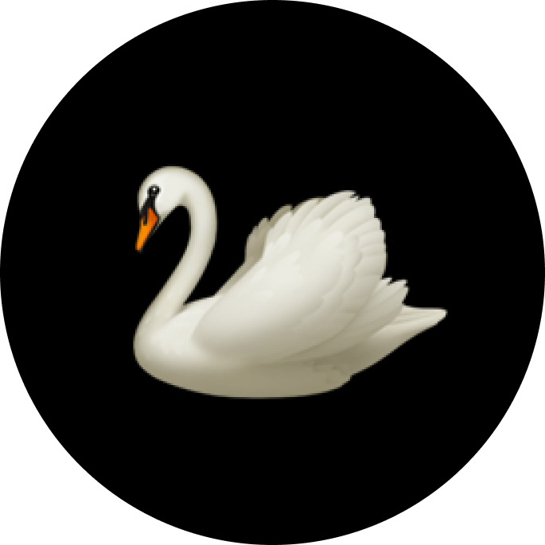

# Swan - Notion as a Website 🦢

Swan is a powerful **Notion-to-Website** engine that turns your Notion workspace into a high-performance, static website. Built with **Next.js**, **PandaCSS**, and the **Notion API**, it offers the simplicity of a CMS with the speed of a static site.



## ✨ Features

- **Heads-free CMS**: Manage 100% of your content (posts, pages, config) in Notion.
- **Blazing Fast**: Static Site Generation (SSG) ensures instant page loads and perfect SEO.
- **Global Search**: Built-in `Cmd+K` command palette to search all content.
- **Multi-Author**: Support for multiple authors with dedicated profile pages.
- **Rich Content**: Supports video embeds, code blocks, callouts, and more.
- **Newsletter Ready**: Native Mailchimp integration form.
- **Code Injection**: Add Analytics, Ads, or Scripts directly from Notion.
- **Theming**: Toggle between Light/Dark modes and preset color themes.
- **RSS Feeds**: Auto-generated feeds for every content collection.
- **Unique Comment System**: Clicking on "comment" opens the user's email client using `mailto` with a pre-filled subject line, initiating a direct email thread between the reader and the author. No databases, no servers, no third-party scripts.

---

## 🚀 Quick Start

### 1. Clone & Install

```bash
git clone https://github.com/arnav-kushesh/swan.git
cd swan
npm install
```

### 2. Configure Environment

Create a `.env.local` file in the root directory:

```bash
NOTION_API_KEY=secret_your_notion_integration_key
ROOT_PAGE_ID=your_root_page_id
```

> **Tip**: obtain your API key from [Notion Integrations](https://www.notion.so/my-integrations) and share your root page with the integration.

### 3. Seed Notion (One-time Setup)

Run the seed script to automatically create the required database structure in your Notion page:

```bash
npm run seed
```

> **Note**: If you encounter broken images in your Notion workspace, run `npm run seed` again to update them with fresh placeholders.
> _This will create specific Pages and Databases (Home, Settings, Collections) in your root page._

### 4. Sync & Run

Download content from Notion and start the dev server:

```bash
npm run sync  # Fetches data to notion_state/
npm run dev   # Starts Next.js at localhost:3000
```

---

## 🛠️ Project Structure

```
swan/
├── app/                 # Next.js App Router pages
├── components/          # React UI components
├── lib/                 # Utilities & Data Fetching
├── scripts/             # Node.js scripts for Notion Sync
│   ├── lib/             # Seeding logic
│   └── sync-notion.mjs  # Main sync script
├── notion_state/        # Local cache of Notion content (JSON/MD)
├── public/              # Static assets & downloaded images
└── panda.config.mjs     # Design system configuration
```

## 🎨 Customizing Design

Swan uses **PandaCSS** for styling.

- **Themes**: Edit `app/themes.css` to customize color variables for Light/Dark modes and other presets (Blue, Green, etc.).
- **Styles**: Global styles are in `app/globals.css`.
- **Layout**: Modify `app/layout.tsx` for site-wide structural changes.

## 📦 Deployment

Swan is designed for static hosting.

### Vercel / Netlify

1. Connect your GitHub repository.
2. Set Environment Variables (`NOTION_API_KEY`, `ROOT_PAGE_ID`) in the dashboard.
3. Set the **Build Command**:
   ```bash
   npm run sync-and-build
   ```
4. Set the **Output Directory**: `out`

### 🔄 Updating Content from Notion

Since Swan is a Static Site Generator (SSG), changes in Notion do NOT appear automatically. You must **trigger a fresh build** (or redeploy) in your hosting dashboard (Netlify/Vercel) to fetch and render new content.

---

## Notion Page Structure

Swan expects the following structure in your Notion workspace:

```
Root Page
├── Home Page
│   ├── [Inline DB] Hero Section (info_section)
│   ├── [Inline DB] My Gallery (dynamic_section)
│   ├── [Inline DB] Selected Projects (dynamic_section)
│   ├── [Inline DB] Recent Writing (dynamic_section)
│   ├── [Inline DB] Custom HTML (html_section)
│   ├── [Inline DB] Embedded Page (iframe_section)
│   ├── [Inline DB] Featured Video (video_embed_section)
│   └── [Inline DB] Leave a Comment (mail_based_comment_section)
├── Navbar Pages
│   ├── About (page, can contain inline DB sections)
│   └── Contact (page, can contain inline DB sections)
├── Collections
│   ├── Gallery (database)
│   ├── Projects (database)
│   └── Blogs (database)
├── Settings
│   ├── General Configuration (database)
│   ├── Configure Collections (page)
│   │   ├── Gallery Settings (inline DB)
│   │   ├── Projects Settings (inline DB)
│   │   └── Blogs Settings (inline DB)
│   ├── HTML Head Code (page with code blocks)
│   ├── CSS Styling (page with code blocks)
│   └── Collection Page Extra Sections
│       ├── Gallery (page with inline DB sections)
│       ├── Projects (page with inline DB sections)
│       └── Blogs (page with inline DB sections)
└── Authors (database)
```

---

## Section Types

Sections are inline databases placed on the Home Page, Navbar Pages, or Collection Extra Sections pages. Each database must have a `section_type` select property to identify its type.

### 1. `info_section`

A static content section with text, image, and optional CTA button.

**Database Properties:**
| Property | Type | Description |
|----------|------|-------------|
| `title` | Title | Section heading |
| `description` | Rich Text | Section body text |
| `link` | URL | Optional CTA button link |
| `image` | Files | Optional hero/feature image |
| `view_type` | Select | Layout: `col_centered_view`, `col_left_view`, `row_view`, `row_reverse_view` |
| `section_type` | Select | Must be `info_section` |
| `enabled` | Checkbox | Show/hide the section |

### 2. `dynamic_section`

Displays items from a collection (blogs, projects, gallery) in various view types.

**Database Properties:**
| Property | Type | Description |
|----------|------|-------------|
| `collection_name` | Title | Name of the collection to display (e.g., "Blogs") |
| `section_title` | Rich Text | Display title for the section |
| `view_type` | Select | Layout: `list_view`, `card_view`, `grid_view`, `minimal_list_view` |
| `section_type` | Select | Must be `dynamic_section` |
| `enabled` | Checkbox | Show/hide the section |

### 3. `html_section`

Renders custom HTML inside a sandboxed iframe. The HTML code is stored as a code block inside the first database row's page content.

**Database Properties:**
| Property | Type | Description |
|----------|------|-------------|
| `title` | Title | Section heading |
| `section_type` | Select | Must be `html_section` |
| `enabled` | Checkbox | Show/hide the section |

**HTML Head Code:** Open the first row as a page, add a code block with your HTML.

### 4. `iframe_section`

Embeds an external webpage in an iframe.

**Database Properties:**
| Property | Type | Description |
|----------|------|-------------|
| `title` | Title | Section heading |
| `url` | URL | The URL to embed |
| `section_type` | Select | Must be `iframe_section` |
| `enabled` | Checkbox | Show/hide the section |

### 5. `video_embed_section`

Embeds a video (YouTube, Vimeo, etc.) using the embed URL.

**Database Properties:**
| Property | Type | Description |
|----------|------|-------------|
| `title` | Title | Section heading |
| `url` | URL | Video embed URL (e.g., `https://www.youtube.com/embed/VIDEO_ID`) |
| `section_type` | Select | Must be `video_embed_section` |
| `enabled` | Checkbox | Show/hide the section |

### 6. `mail_based_comment_section`

A simple email-based comment form using `mailto:` links.

**Database Properties:**
| Property | Type | Description |
|----------|------|-------------|
| `topic_title` | Title | Email subject line |
| `author_email` | Rich Text | Recipient email address |
| `section_type` | Select | Must be `mail_based_comment_section` |
| `enabled` | Checkbox | Show/hide the section |

---

## Collections

Collections are full-page databases stored under the "Collections" page. Each item in a collection has:

| Property           | Type         | Description                           |
| ------------------ | ------------ | ------------------------------------- |
| `Title`            | Title        | Item title                            |
| `Description`      | Rich Text    | Short description                     |
| `Image`            | Files        | Cover/thumbnail image                 |
| `Tags`             | Multi-select | Categorization tags                   |
| `Link`             | URL          | External link                         |
| `order_priority`   | Number       | Sort order (higher = first)           |
| `author_username`  | Rich Text    | Author username (links to Authors DB) |
| `video_embed_link` | URL          | Optional video embed URL              |

The page content (body) of each item becomes the full article content, rendered as markdown.

---

## General Configuration

The "General Configuration" database in Settings stores site-wide settings as key-value pairs:

| Key                               | Description                                                                              |
| --------------------------------- | ---------------------------------------------------------------------------------------- |
| `title`                           | Site title                                                                               |
| `tagline`                         | Site tagline/subtitle                                                                    |
| `description`                     | Meta description                                                                         |
| `logo`                            | Site logo (via Media field)                                                              |
| `favicon`                         | Favicon image (via Media field)                                                          |
| `og_image`                        | OpenGraph image (via Media field)                                                        |
| `keywords`                        | SEO keywords                                                                             |
| `sidebar_navigation`              | `true`/`false` - Enable sidebar by default                                               |
| `disable_logo_in_topbar`          | `true`/`false`                                                                           |
| `disable_logo_in_sidebar`         | `true`/`false`                                                                           |
| `default_color_mode`              | Default theme: `light`, `dark`, `blue`, `pink`, `red`, `green`, `brown`, `cream`, `rose` |
| `social_github`                   | GitHub profile URL                                                                       |
| `social_twitter`                  | Twitter/X profile URL                                                                    |
| `social_linkedin`                 | LinkedIn profile URL                                                                     |
| `social_instagram`                | Instagram profile URL                                                                    |
| `social_youtube`                  | YouTube channel URL                                                                      |
| `social_facebook`                 | Facebook profile URL                                                                     |
| `social_twitch`                   | Twitch channel URL                                                                       |
| `social_email`                    | Contact email                                                                            |
| `enable_newsletter`               | `true`/`false` - Enable newsletter functionality                                         |
| `mailchimp_form_link`             | Mailchimp form URL                                                                       |
| `show_newsletter_section_on_home` | `true`/`false`                                                                           |
| `mention_this_tool_in_footer`     | `true`/`false` - Show "Built with Swan" in footer                                        |

---

## Color Modes

Swan supports 9 color themes:

| Theme   | Description                |
| ------- | -------------------------- |
| `light` | Clean white/gray (default) |
| `dark`  | Dark mode                  |
| `blue`  | Midnight blue              |
| `pink`  | Berry pink/purple          |
| `red`   | Sunset red                 |
| `green` | Forest green               |
| `brown` | Coffee brown               |
| `cream` | Light cream/warm white     |
| `rose`  | Light pink                 |

Set the default via `default_color_mode` in General Configuration. Users can change themes via the Settings menu or the Experiment panel.

---

## Navigation Modes

Swan supports two navigation layouts:

- **Navbar (Top Bar):** Default. Shows logo, navigation links, social icons, settings, and search.
- **Sidebar (Left Panel):** Fixed left sidebar with profile, navigation, social icons, and settings.

Set the default via `sidebar_navigation` in General Configuration. Users can toggle via the Experiment panel (changes don't persist).

---

## Code & CSS Injection

- **HTML Head Code** page (under Settings): Add code blocks containing `<script>` tags or other HTML to inject into `<head>`.
- **CSS Styling** page (under Settings): Add code blocks containing CSS to inject as `<style>` tags in `<head>`.

---

## Authors

The Authors database stores author profiles:

| Property           | Type      | Description                                     |
| ------------------ | --------- | ----------------------------------------------- |
| `name`             | Title     | Display name                                    |
| `username`         | Rich Text | Unique username (used to link posts to authors) |
| `email`            | Email     | Contact email                                   |
| `description`      | Rich Text | Bio                                             |
| `picture`          | Files     | Profile picture                                 |
| `instagram_handle` | Rich Text | Instagram username                              |
| `x_handle`         | Rich Text | X/Twitter username                              |
| `github_handle`    | Rich Text | GitHub username                                 |

---

## Collection Page Extra Sections

Extra sections can be added to collection entry pages (blog posts, projects, etc.) via:

**Settings > Collection Page Extra Sections > [Collection Name]**

Each collection name page contains inline databases representing sections. These sections are rendered on every entry page of that collection, above the comment/email section.

All section types are supported (info, dynamic, html, iframe, video_embed, mail_based_comment).

---

## Navbar Page Sections

Navbar pages (About, Contact, etc.) can also contain inline database sections. Any inline database on a navbar page that has a `section_type` property will be rendered as a section below the page content.

---

## Experiment Panel

A floating "Experiment" button in the bottom-right corner opens a panel for trying out different settings:

- **Section Views:** Change the view type of any homepage section in real time
  - _Info sections:_ `col_centered_view`, `col_left_view`, `row_view`, `row_reverse_view`
  - _Dynamic sections:_ `list_view`, `card_view`, `grid_view`, `minimal_list_view`
- **Color Mode:** Switch between all 9 themes
- **Sidebar Toggle:** Enable/disable sidebar navigation

Changes made via the Experiment panel are **temporary** and will not persist after a page refresh. This is intentional for experimentation purposes.

---

## RSS Feeds

RSS feeds are auto-generated for collections with `enable_rss: true` in their collection settings. Access them at `/rss/[collection-name]`.

---

## Search

Swan includes a built-in search (Cmd+K / Ctrl+K) that searches across all collection items by title, description, collection name, and tags.

---

## Data Flow

```
Notion Workspace
    ↓ npm run sync
notion_state/ (local JSON + Markdown cache)
    ↓ npm run build
Static HTML/CSS/JS (Next.js static export)
```

1. **Sync:** Fetches all data from Notion API, downloads images, converts pages to markdown
2. **Build:** Next.js reads from `notion_state/` and generates a fully static site
3. **Deploy:** Upload the `out/` directory to any static hosting (Vercel, Netlify, GitHub Pages, etc.)

## 🤝 Contributing

Contributions are welcome!.

## 📄 License

MIT © [Arnav Kushesh](https://github.com/arnav-kushesh)
